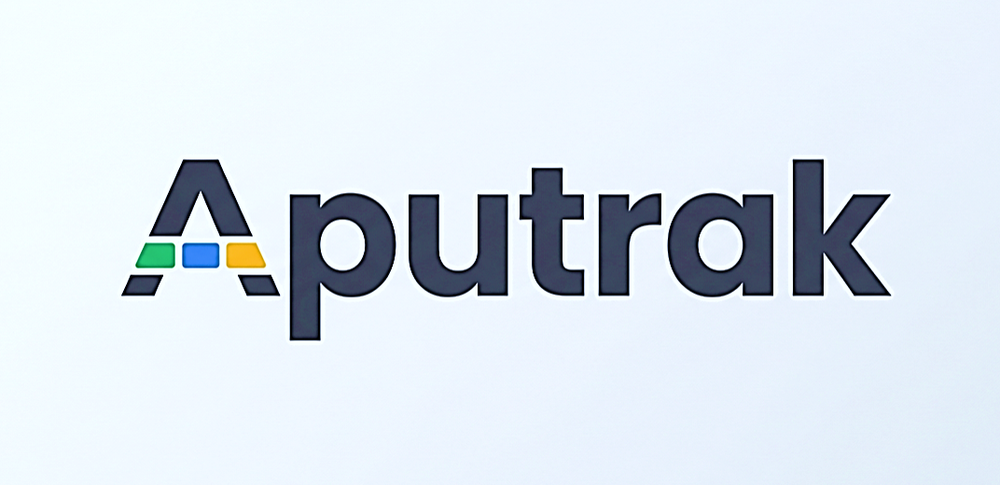
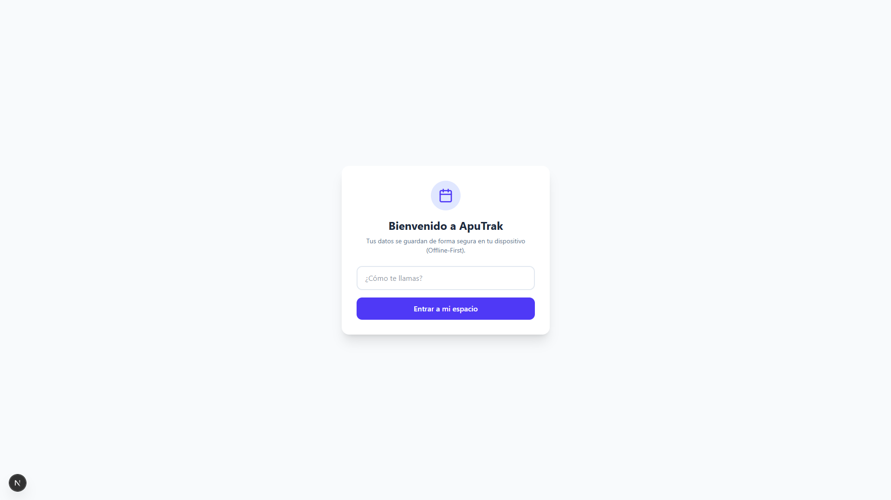
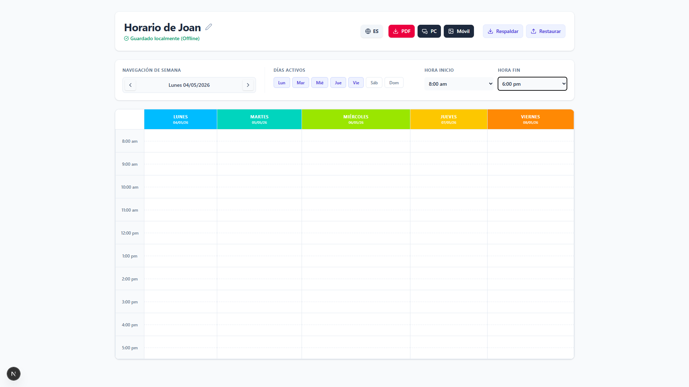
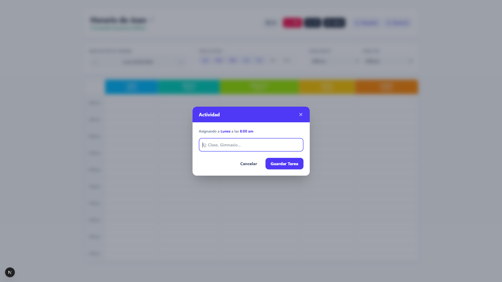
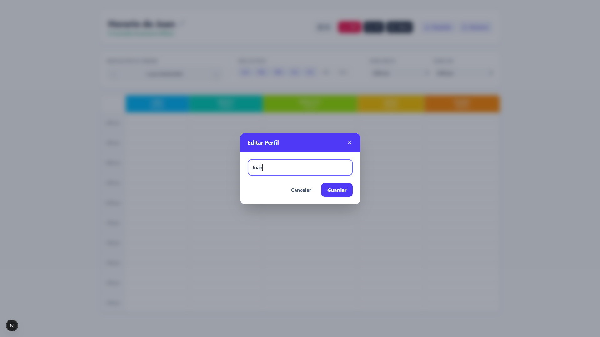

# 🏔️ Aputrak

> Aplicación web moderna orientada a la gestión de horarios y actividades, diseñada bajo una arquitectura **Offline-First** para ofrecer disponibilidad total incluso sin conexión a internet.

<p align="center">
  
</p>

<p align="center">
  
  
  
  
  
</p>

---

# 📖 Descripción

**Aputrak** es una aplicación web moderna enfocada en la organización de horarios, seguimiento de actividades y administración de perfiles de usuario, implementada con una filosofía **Offline-First**.

La aplicación permite que los usuarios continúen trabajando incluso sin acceso a internet gracias al uso de **IndexedDB** como almacenamiento local persistente. Toda la información relevante —credenciales, horarios y actividades— permanece disponible de manera segura en el dispositivo del usuario.

Además, Aputrak incorpora soporte multilenguaje, una interfaz moderna y una experiencia de usuario optimizada para aplicaciones rápidas, fluidas y altamente accesibles.

---

# ✨ Características Principales

## 📶 Arquitectura Offline-First

* Persistencia local utilizando **IndexedDB**
* Funcionamiento completo sin conexión
* Acceso instantáneo a horarios y actividades
* Almacenamiento seguro en el dispositivo del usuario
* Preparado para futuras estrategias de sincronización

---

## 🌍 Internacionalización Inteligente (i18n)

* Soporte nativo para:

  * 🇪🇸 Español
  * 🇺🇸 Inglés
* Detección automática de idioma basada en:

  * Geolocalización por IP
  * Preferencias guardadas (`aputrak_lang`)
* Cambio dinámico de idioma en tiempo real

---

## 📅 Cuadrícula de Horarios Interactiva

El componente `ScheduleGrid` permite:

* Visualización semanal organizada
* Gestión intuitiva de actividades
* Distribución clara de horarios
* Mejor seguimiento de tareas y productividad

---

## 🔐 Autenticación Local

Sistema de autenticación completamente local:

* Login Offline
* Gestión de sesión persistente
* Sin dependencia inmediata de servidores externos
* Ideal para:

  * Aplicaciones personales
  * Entornos privados
  * Sistemas rápidos de acceso local

---

## 🎨 UI/UX Moderna

Interfaz diseñada con enfoque en experiencia de usuario:

* Diseño responsivo
* Componentes reutilizables
* Modales fluidos
* Sistema de notificaciones Toast
* Experiencia minimalista y moderna
* Estilizado con **Tailwind CSS**

---

# 📸 Capturas de Pantalla

## 🔑 Pantalla de Inicio de Sesión

<p align="center">
  
</p>

---

## 📅 Cuadrícula de Horarios

<p align="center">
  
</p>

---

## 📝 Modal de Actividades

<p align="center">
  
</p>

---

## 👤 Edición de Perfil

<p align="center">
  
</p>

---

# 🛠️ Tecnologías Utilizadas

| Tecnología               | Descripción                            |
| ------------------------ | -------------------------------------- |
| **Next.js (App Router)** | Framework principal para la aplicación |
| **TypeScript**           | Tipado estático y escalabilidad        |
| **Tailwind CSS**         | Estilizado moderno y responsivo        |
| **IndexedDB**            | Persistencia local Offline-First       |
| **Lucide React**         | Sistema de iconografía moderna         |

---

# 🧱 Arquitectura del Proyecto

```bash
aputrak/
├── public/                     # Recursos estáticos
│   ├── icons/
│   └── images/
│
├── docs/
│   └── images/                 # Capturas y assets del README
│
├── src/
│   ├── app/                    # App Router de Next.js
│   │   ├── layout.tsx
│   │   ├── page.tsx
│   │   └── ...
│   │
│   ├── components/             # Componentes reutilizables
│   │   ├── ui/
│   │   │   ├── Toast.tsx
│   │   │   ├── LoadingOverlay.tsx
│   │   │   └── ...
│   │   │
│   │   ├── Header.tsx
│   │   ├── Login.tsx
│   │   ├── ScheduleGrid.tsx
│   │   └── ...
│   │
│   ├── hooks/                  # Custom Hooks
│   │   ├── useLanguage.ts
│   │   ├── useOfflineAuth.ts
│   │   ├── useOfflineSchedule.ts
│   │   └── useAppManager.ts
│   │
│   ├── lib/                    # Utilidades y configuración
│   │   ├── db.ts
│   │   ├── i18n.ts
│   │   └── ...
│   │
│   ├── styles/
│   └── types/
│
├── tailwind.config.ts
├── tsconfig.json
├── package.json
└── README.md
```

---

# 🚀 Instalación y Uso Local

## 1️⃣ Clonar el repositorio

```bash
git clone https://github.com/tu-usuario/aputrak.git
cd aputrak
```

---

## 2️⃣ Instalar dependencias

Usando npm:

```bash
npm install
```

O usando Yarn:

```bash
yarn install
```

O usando pnpm:

```bash
pnpm install
```

---

## 3️⃣ Iniciar servidor de desarrollo

```bash
npm run dev
```

---

## 4️⃣ Abrir en el navegador

Visita:

```bash
http://localhost:3000
```

---

# ⚙️ Variables y Configuración

Si deseas extender el proyecto con sincronización remota, autenticación híbrida o APIs externas, puedes crear un archivo:

```bash
.env.local
```

Ejemplo:

```env
NEXT_PUBLIC_API_URL=http://localhost:8080
NEXT_PUBLIC_DEFAULT_LANGUAGE=es
```

---

# 🧠 Filosofía del Proyecto

Aputrak fue diseñado bajo principios modernos de desarrollo:

* **Offline-First**
* **UX centrada en velocidad**
* **Persistencia local**
* **Arquitectura escalable**
* **Componentización**
* **Internacionalización**
* **Responsividad**
* **Experiencia fluida**

---

# 🔮 Posibles Mejoras Futuras

* 🔄 Sincronización en la nube
* ☁️ Backup automático
* 📱 Progressive Web App (PWA)
* 🔔 Notificaciones push
* 👥 Sistema multiusuario
* 📊 Estadísticas y analíticas
* 🗓️ Integración con calendarios externos
* 🔐 Encriptación avanzada de datos locales

---

# 🤝 Contribución

Las contribuciones son bienvenidas.

Si deseas mejorar Aputrak:

1. Haz un Fork del proyecto
2. Crea una nueva rama:

```bash
git checkout -b feature/nueva-funcionalidad
```

3. Realiza tus cambios y haz commit:

```bash
git commit -m "feat: agregar nueva funcionalidad"
```

4. Haz push a tu rama:

```bash
git push origin feature/nueva-funcionalidad
```

5. Abre un Pull Request

---

# 📄 Licencia

Este proyecto está bajo la licencia **MIT**.

Consulta el archivo [LICENSE](LICENSE) para más información.

---

# 👨‍💻 Autor

Desarrollado por **Juan** 🚀

Apasionado por el desarrollo de software, arquitectura moderna y experiencias Offline-First.

---

<p align="center">
  <strong>Aputrak — Productividad sin límites, incluso sin conexión.</strong>
</p>
